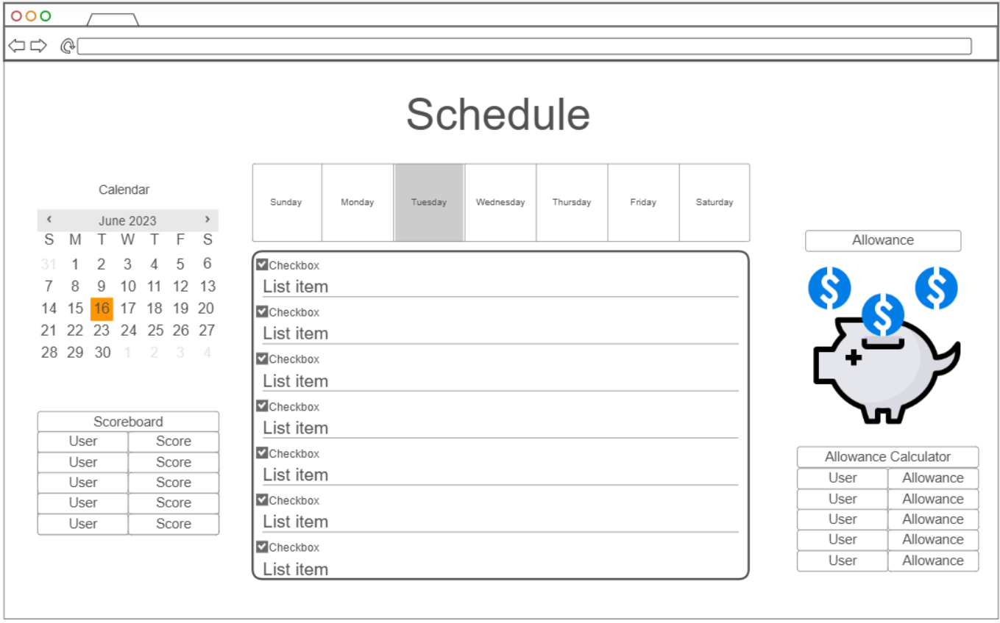
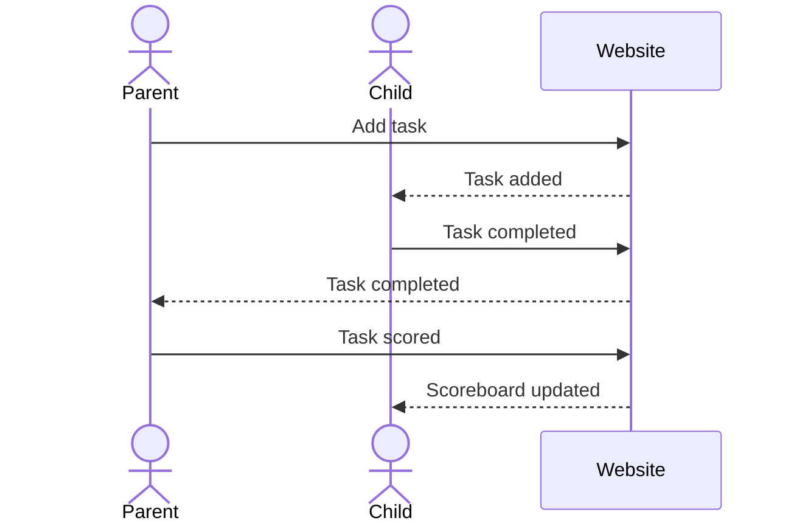

# 🙉 ChoreChamp

[My Notes](notes.md)

This web application will be a calendar with weekly to-do lists. The weekly to-do lists will be used to create chores and will have a scoreboard and calculator for allowances. Admins create the to-do list and add objectives thereto. Admins are able to add viewers(users that cannot edit list but can request task completion). Admins can score tasks completed by users, giving points to the users, which will be referenced later when calculating allowance at the end of the week.

> [!NOTE]
>  This is a template for your startup application. You must modify this `README.md` file for each phase of your development. You only need to fill in the section for each deliverable when that deliverable is submitted in Canvas. Without completing the section for a deliverable, the TA will not know what to look for when grading your submission. Feel free to add additional information to each deliverable description, but make sure you at least have the list of rubric items and a description of what you did for each item.

> [!NOTE]
>  If you are not familiar with Markdown then you should review the [documentation](https://docs.github.com/en/get-started/writing-on-github/getting-started-with-writing-and-formatting-on-github/basic-writing-and-formatting-syntax) before continuing.

## 🚀 Specification Deliverable

> [!NOTE]
>  Fill in this sections as the submission artifact for this deliverable. You can refer to this [example](https://github.com/webprogramming260/startup-example/blob/main/README.md) for inspiration.

For this deliverable I did the following. I checked the box `[x]` and added a description for things I completed.

- [x] Proper use of Markdown
- [x] A concise and compelling elevator pitch
- [x] Description of key features
- [x] Description of how you will use each technology
- [x] One or more rough sketches of your application. Images must be embedded in this file using Markdown image references.

### Elevator pitch

Ever wish your kids were excited to get their chores done? Meet ChoreChamp — the weekly calendar app that turns to-do lists into teamwork, points, and cold hard cash! Admins ( parents) create tasks, viewers (kids) complete them, and everyone watches the live scoreboard change in real time. Complete tasks, score points, track progress, and cash in at the end of the week. Your kids will be excited when a new task pops up! Use ChoreChamp and your kids will be racing to get their chores done!

### Design

Here is a diagram that shows administrators would interact with the website in order to set up tasks and score tasks, and how viewers are able to accept and complete tasks.

### Key features

- Secure login over HTTPS
- Administrator can create tasks and assign them to a day or week
- Administrator can give a point value to each task
- Viewers can select tasks for approval and scoring
- Scoreboard for all users updated in real-time
- Allowance is calculated in real-time and locked at the end of the week

### Technologies

I am going to use the required technologies in the following ways.

- **HTML** - HTML will structure the web application's user interface: the layout of the weekly calendar, to-do list items, task completion forms, user login/register forms, and the scoreboard.
- **CSS** - CSS will style the calendar, weekly to-do list, color the tasks based on completion (green = finished, yellow = pending approval, gray = needing completion), and design the scoreboard.
- **React** - React will take care of the login, live task updates, scoreboard updates, and allowance updates. It will also allow admins and viewers to see previous months/weeks.
- **Service** - Backend service with endpoints for login, retrieving tasks(viewers), submitting tasks for approval (viewers), retrieving pending tasks (admins), retrieving scoreboard updates, and retrieving end-of-week allowances.
- **DB/Login** - Store admins and viewers, tasks, pending approval tasks, and completed tasks in database. Register and login for users.
- **WebSocket** - Takes care of updating website whenever a change is made, i.e. new task, pending approval task, task completion, scoreboard update, allowance finalized.

## 🚀 AWS deliverable

For this deliverable I did the following. I checked the box `[x]` and added a description for things I completed.

- [ ] **Server deployed and accessible with custom domain name** - [My server link](https://yourdomainnamehere.click).

## 🚀 HTML deliverable

For this deliverable I did the following. I checked the box `[x]` and added a description for things I completed.

- [ ] **HTML pages** - I did not complete this part of the deliverable.
- [ ] **Proper HTML element usage** - I did not complete this part of the deliverable.
- [ ] **Links** - I did not complete this part of the deliverable.
- [ ] **Text** - I did not complete this part of the deliverable.
- [ ] **3rd party API placeholder** - I did not complete this part of the deliverable.
- [ ] **Images** - I did not complete this part of the deliverable.
- [ ] **Login placeholder** - I did not complete this part of the deliverable.
- [ ] **DB data placeholder** - I did not complete this part of the deliverable.
- [ ] **WebSocket placeholder** - I did not complete this part of the deliverable.

## 🚀 CSS deliverable

For this deliverable I did the following. I checked the box `[x]` and added a description for things I completed.

- [ ] **Header, footer, and main content body** - I did not complete this part of the deliverable.
- [ ] **Navigation elements** - I did not complete this part of the deliverable.
- [ ] **Responsive to window resizing** - I did not complete this part of the deliverable.
- [ ] **Application elements** - I did not complete this part of the deliverable.
- [ ] **Application text content** - I did not complete this part of the deliverable.
- [ ] **Application images** - I did not complete this part of the deliverable.

## 🚀 React part 1: Routing deliverable

For this deliverable I did the following. I checked the box `[x]` and added a description for things I completed.

- [ ] **Bundled using Vite** - I did not complete this part of the deliverable.
- [ ] **Components** - I did not complete this part of the deliverable.
- [ ] **Router** - I did not complete this part of the deliverable.

## 🚀 React part 2: Reactivity deliverable

For this deliverable I did the following. I checked the box `[x]` and added a description for things I completed.

- [ ] **All functionality implemented or mocked out** - I did not complete this part of the deliverable.
- [ ] **Hooks** - I did not complete this part of the deliverable.

## 🚀 Service deliverable

For this deliverable I did the following. I checked the box `[x]` and added a description for things I completed.

- [ ] **Node.js/Express HTTP service** - I did not complete this part of the deliverable.
- [ ] **Static middleware for frontend** - I did not complete this part of the deliverable.
- [ ] **Calls to third party endpoints** - I did not complete this part of the deliverable.
- [ ] **Backend service endpoints** - I did not complete this part of the deliverable.
- [ ] **Frontend calls service endpoints** - I did not complete this part of the deliverable.
- [ ] **Supports registration, login, logout, and restricted endpoint** - I did not complete this part of the deliverable.

## 🚀 DB deliverable

For this deliverable I did the following. I checked the box `[x]` and added a description for things I completed.

- [ ] **Stores data in MongoDB** - I did not complete this part of the deliverable.
- [ ] **Stores credentials in MongoDB** - I did not complete this part of the deliverable.

## 🚀 WebSocket deliverable

For this deliverable I did the following. I checked the box `[x]` and added a description for things I completed.

- [ ] **Backend listens for WebSocket connection** - I did not complete this part of the deliverable.
- [ ] **Frontend makes WebSocket connection** - I did not complete this part of the deliverable.
- [ ] **Data sent over WebSocket connection** - I did not complete this part of the deliverable.
- [ ] **WebSocket data displayed** - I did not complete this part of the deliverable.
- [ ] **Application is fully functional** - I did not complete this part of the deliverable.
